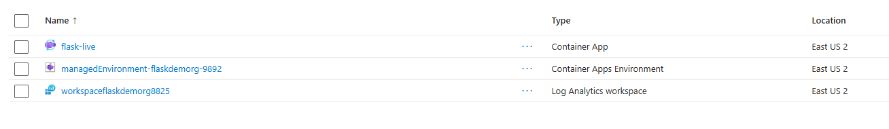

# Dockerized Flask Store App on Azure  


This repository hosts a **Dockerized Flask web store application** deployed on **Azure Container Apps**.  

The project demonstrates how to containerize a lightweight Python web application and deploy it to the cloud, making it suitable for e-commerce demos or small-scale store prototypes.

---

## Overview

- **Framework:** Flask 2.3.3  
- **Server:** Gunicorn (production-ready WSGI server)  
- **Containerization:** Docker  
- **Cloud Deployment:** Azure Container Apps (managed environment)



The application provides a web interface for browsing products and simulates an online store experience, running entirely inside a Docker container.

---

## Docker Setup

### Dockerfile

```dockerfile
# Use a stable Python base image
FROM python:3.12-slim

# Set working directory
WORKDIR /app

# Copy application files
COPY . /app

# Install dependencies
RUN pip install --no-cache-dir -r requirements.txt

# Expose application port
EXPOSE 5000

# Run the app with Gunicorn
CMD ["gunicorn", "app:app", "--bind", "0.0.0.0:5000"]
```

---

## Conclusion: Benefits of Dockerized Deployment

Containerizing the Flask store application with Docker provides several strategic advantages:

- **Portability:** The application runs consistently across local, staging, and production environments without configuration conflicts.
- **Reproducibility:** All dependencies and environment configurations are encapsulated within the container, eliminating the classic *“it works on my machine”* issue.
- **Scalability:** Containers can be easily replicated and orchestrated on platforms like Azure Container Apps to handle increased traffic and load.
- **Team Efficiency:** Developers can spin up a fully configured environment without manually installing Python, Flask, Gunicorn, or dependencies.

### Estimated Time Savings

- Manual environment setup typically takes **2–4 hours per developer**.
- With Docker, setup time is reduced to **10–15 minutes**.
- This represents an estimated **85–90% reduction in setup time**.

This efficiency enables teams to focus on development, testing, and feature delivery instead of environment configuration.

> Overall, Docker significantly reduces deployment friction, standardizes workflows, and accelerates collaboration within development teams.
